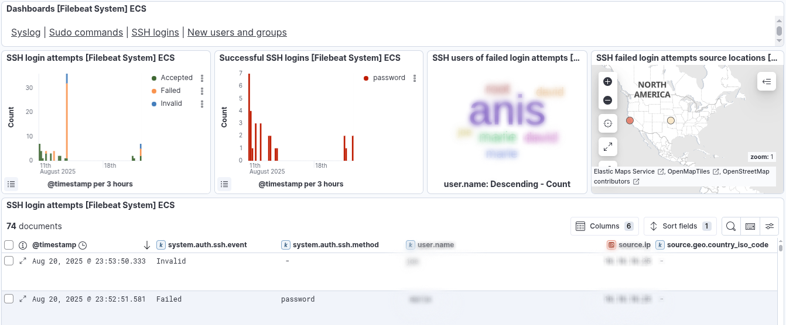
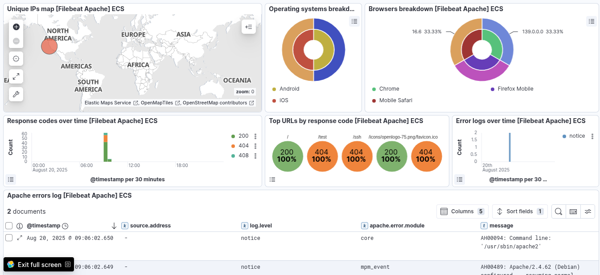
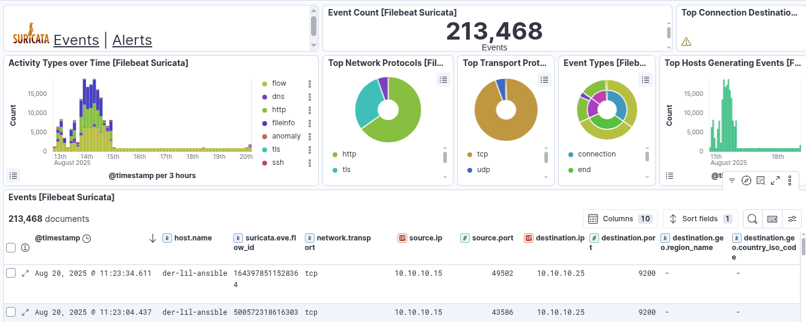

# Projet SIEM – Installation et Configuration ELK + Filebeat


## Contexte

Ce lab met en place un **SIEM** basé sur la stack **ELK** (Elasticsearch, Logstash, Kibana) pour collecter, analyser et visualiser les logs provenant de plusieurs sources :

- **System** : Syslog, commandes sudo, connexions SSH, création d’utilisateurs/groupes
- **Apache** : logs d’accès et d’erreur
- **Suricata** : alertes IDS/IPS réseau

---

## Prérequis

- **VM ou serveur Linux** (Debian/Ubuntu 20.04+ recommandé)
- Accès root ou sudo
- Ports ouverts :
  - 9200 (Elasticsearch)
  - 5601 (Kibana)
  - 5044 (Logstash Beats input)
- Connexion internet pour télécharger les paquets Elastic

---

## Installation de la stack ELK

### Ajouter le dépôt Elastic
```bash
wget -qO - https://artifacts.elastic.co/GPG-KEY-elasticsearch | sudo gpg --dearmor -o /usr/share/keyrings/elasticsearch-keyring.gpg
echo "deb [signed-by=/usr/share/keyrings/elasticsearch-keyring.gpg] https://artifacts.elastic.co/packages/8.x/apt stable main" | sudo tee /etc/apt/sources.list.d/elastic-8.x.list
sudo apt-get update
```

### Installer Elasticsearch
```bash
sudo apt-get install elasticsearch -y
sudo systemctl daemon-reload
sudo systemctl enable elasticsearch.service
sudo systemctl start elasticsearch.service
```

**Configuration `/etc/elasticsearch/elasticsearch.yml` :**
```yaml
cluster.name: my
node.name: elk
path.data: /var/lib/elasticsearch
path.logs: /var/log/elasticsearch
network.host: 0.0.0.0
http.port: 9200
discovery.seed_hosts: ["127.0.0.1"]  
cluster.initial_master_nodes: ["elk"]

xpack.security.enabled: true
xpack.security.enrollment.enabled: true

xpack.security.http.ssl:
  enabled: true
  keystore.path: certs/http.p12

xpack.security.transport.ssl:
  enabled: true
  verification_mode: certificate
  keystore.path: certs/transport.p12
  truststore.path: certs/transport.p12
```

---

### Installer Kibana
```bash
sudo apt-get install kibana -y
sudo systemctl daemon-reload
sudo systemctl enable kibana.service
sudo systemctl start kibana.service
```

**Configuration `/etc/kibana/kibana.yml` :**
```yaml
server.host: "0.0.0.0"
server.name: "localhost"
elasticsearch.hosts: ["http://<YOUR-IP>:9200"]
server.ssl.enabled: false
```

---

### Installer Logstash
```bash
sudo apt-get install logstash -y
```

**Exemple de pipeline `/etc/logstash/conf.d/ssh-parser.conf` :**
```conf
input {
  file {
    path => "/var/log/auth.log"
    type => "ssh"
  }
}

filter {
  if [type] == "ssh" {
    grok {
      match => { "message" => "%{SYSLOGTIMESTAMP:timestamp} %{SYSLOGHOST:hostname} sshd(?:\[%{POSINT:pid}\])?: %{DATA:auth_message}" }
    }
    date {
      match => [ "timestamp", "MMM d HH:mm:ss", "MMM dd HH:mm:ss" ]
    }
  }
}

output {
  elasticsearch {
    hosts => ["https://<IP-ELASTIC>:9200"]
    ssl_certificate_verification => false
    index => "sshloger-%{+YYYY.MM.dd}"
    user => "<elastic-username>"
    password => "<elastic-password>"
  }
}
```

---

##  Configuration de la sécurité Elastic

- Générer un token pour Kibana :
```bash
sudo /usr/share/elasticsearch/bin/elasticsearch-create-enrollment-token -s kibana
```

- Vérifier le code Kibana :
```bash
sudo /usr/share/kibana/bin/kibana-verification-code
```

- Réinitialiser le mot de passe `elastic` :
```bash
sudo /usr/share/elasticsearch/bin/elasticsearch-reset-password -u elastic -a
```

---

##  Installation et configuration de Filebeat (clients)

### Installation
```bash
sudo apt-get install filebeat -y
```

### Activer les modules
```bash
sudo filebeat modules enable system apache suricata
```

### Configurer les modules

**`/etc/filebeat/modules.d/system.yml`**
```yaml
- module: system
  syslog:
    enabled: true
    var.paths: ["/var/log/syslog*"]
  auth:
    enabled: true
    var.paths: ["/var/log/auth.log*"]
```

**`/etc/filebeat/modules.d/apache.yml`**
```yaml
- module: apache
  access:
    enabled: true
    var.paths: ["/var/log/apache2/access.log*"]
  error:
    enabled: true
    var.paths: ["/var/log/apache2/error.log*"]
```

**`/etc/filebeat/modules.d/suricata.yml`**
```yaml
- module: suricata
  eve:
    enabled: true
    var.paths: ["/var/log/suricata/eve.json"]
```

---

### Configurer Filebeat pour envoyer vers ELK

**`/etc/filebeat/filebeat.yml`**
```yaml
output.elasticsearch:
  hosts: ["https://<IP-ELASTIC>:9200"]
  username: "elastic"
  password: "<motdepasse>"
  ssl.verification_mode: none

setup.kibana:
  host: "<IP-KIBANA>:5601"
```

---

### Charger les dashboards
```bash
sudo filebeat setup --dashboards
```

---

### Démarrer Filebeat
```bash
sudo systemctl enable filebeat
sudo systemctl start filebeat
```

---

##  Vérification dans Kibana

- **[Filebeat System] Syslog dashboard** → syslog, sudo, ssh, nouveaux utilisateurs/groupes



- **[Filebeat Apache] Access and error logs** → trafic web, erreurs http


- **[Filebeat Suricata] Alerts** → alertes IDS/IPS


---

##  Résultat attendu

- Logs centralisés dans Elasticsearch
- Dashboards prêts à l’emploi dans Kibana
- Détection en temps réel des événements critiques

---
